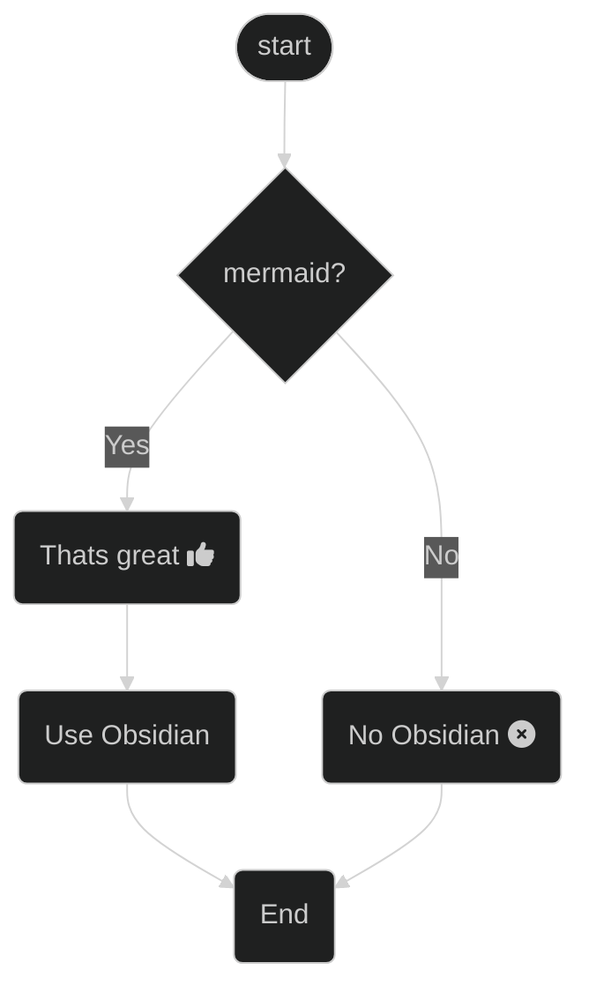

# obsidian-repo

Trial using obsidian and git.

Can I use mermaid here?

```mermaid
%%{init: {'theme': 'dark'}}%%
graph TD
	A([start]) --> B{mermaid?}
	B -->|Yes| C(Thats great fa:fa-thumbs-up) --> D(Use Obsidian)
	B -->|No| E(No Obsidian fa:fa-circle-xmark)
	D --> F(End)
	E --> F
	
```

:SiGithub: bryokim
